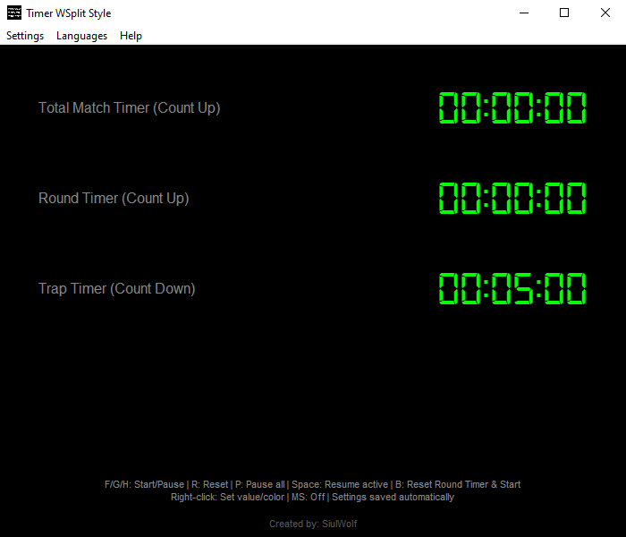
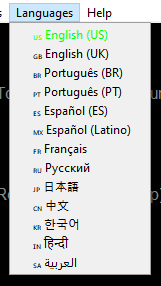
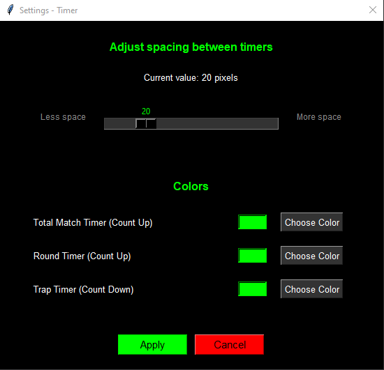
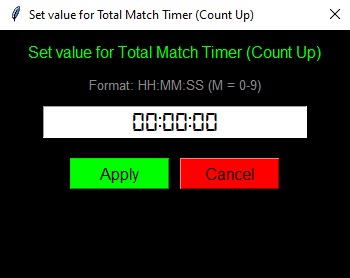

# Console-Manual-Timer

**An accessible and lightweight timer for console players**

## 📸 Screenshots

| Main Interface | Language Selection |
|----------------|-------------------|
|  |  |

| Settings Window | Set Timer Value |
|----------------|-----------------|
|  |  |

## ✨ Features

- **3 Independent Timers**
  - Timer 1: Total Match Timer (Count Up)
  - Timer 2: Round Timer (Count Up) 
  - Timer 3: Trap Timer (Count Down)

- **🎮 Console-Friendly Controls**
  - `F` - Start/Pause Timer 1 (Total Match)
  - `G` - Start/Pause Timer 2 (Round)
  - `H` - Start/Pause Timer 3 (Trap)
  - `R` - Reset all timers
  - `P` - Pause all timers
  - `Space` - Resume only active timers
  - `B` - Reset Round Timer and start automatically

- **🌍 Multi-Language Support (14 Languages)**
  - 🇺🇸 English (US) | 🇬🇧 English (UK)
  - 🇧🇷 Português (BR) | 🇵🇹 Português (PT)
  - 🇪🇸 Español (ES) | 🇲🇽 Español (Latino)
  - 🇫🇷 Français | 🇷🇺 Русский
  - 🇯🇵 日本語 | 🇨🇳 中文
  - 🇰🇷 한국어 | 🇮🇳 हिन्दी
  - 🇸🇦 العربية | 🏛️ Latina

- **⚙️ Customizable Settings**
  - Adjust vertical spacing between timers
  - Change colors for each timer individually
  - Toggle milliseconds display (1 digit precision)
  - Settings are automatically saved in JSON

- **🎯 Precise Timing**
  - Based on real-time system clock
  - No drift even on slow PCs
  - Accurate to 1/10th of a second

- **🖱️ Interactive Features**
  - Right-click any timer to set initial value
  - Right-click any timer to change its color
  - Text labels auto-hide when window is resized below 500px
  - Fully resizable window

## 🚀 Installation

### Prerequisites
- Python 3.7 or higher
- Tkinter (included with Python)
